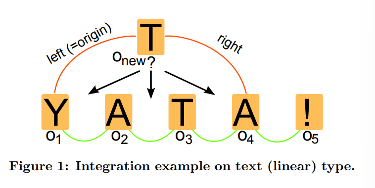

# Near Real-Time Peer-to-Peer Shared Editing on Extensible Data Types

## Abstract

实时协作通常使用`OT`(Operational Transformation), 现在又流行起来 `CRDT`(Commutative Replicated Data Types)。但是大多数已有的实现方法都不是通用的，需要在可读性、基础设施、性能和复杂度之间进行权衡。同时随着`WebRTC`这种多路客户端通讯技术的广泛使用，创造了对性能良好的支持P2P的算法的需求。

本文出了算法`YATA`, 为P2P实时协作设计，能保证结果收敛，保护用户的操作意图，支持离线编辑，并可用于 Web 浏览器中的任意数据类型。

## 介绍

`NRT 协作技术`(近实时协作技术), 常规使用`OT`。优点是不需要任何锁定机制来确保数据一致性。在一个`NRT`场景中，用户修改的内容会立刻写入本地的`Copy`，同时利用通讯协议，将这些修改的内容通知给其他客户端。所有数据的`Copy` 最终都应该数据一致，无论收到的操作的次序是否相同，或遇到信息传递的错误，比如临时断线等等。

Web 技术的进步带来了一些高速可靠的通讯协议，比如`WebRTC`,`WebSockets`, `XMPP over Websockets`, `Server-Sent Events`。这些技术推动了`P2P`协同编辑算法，并为算法提供了快速可靠的基础设施。`P2P`实现成为了一个传统`client-server`实现的一个可行的替代。每一个协作者在 `多路通讯`(N-way communication)中获取更新信息并且应用给本地，无需来自中心服务器的确认数据、指令或者转换操作。因此现有的NRT协作算法需要适应新的性能要求。这不是一项简单的任务，特别是在大规模协作的情况下，随着用户数量的增加和变化(`client-server`模式下连接数量是固定的)。

绝大部分`OT`算法是为`client-server`模式设计。其中支持`P2P`多路通讯的算法依旧需要在每一个消息中附带一个`state vector`(状态向量)。此外。需要在服务器端进行预处理的算法不能用于`P2P`环境。`CRDT`算法些具有较小的文件更新规模，并且不依赖`vector clocks`(矢量时钟)。因此可以适应新的通信协议和网络上的做法。

`YATA`(Yet Another Transformation Approach)设计目标就是为了克服这些现有算法的缺陷。这个算法确保了数据一致性、协作编辑时的编辑意图保留。 `YATA`从设计上会引发更少的数据冲突，更好的时间复杂度，支持离线编辑（比如支持客户端加入一个存在未同步修改的协作会话），支持多种数据类型。算法内部使用了`链表`的数据结构。此外`YATA`引入了一个垃圾回收器来避免急剧增加的无用的操作，以解决常见的`CRDT`算法中保留被删除操作导致的性能损失。

`Yjs` 是这个算法的一个开源实现，已经证明了这个算法性能优异，对于小型程序而言，协作机制很容易编写。

## 相关工作

过往的研究提出了多种技术来解决协同编辑环境下的冲突。20世纪80年代末提出了并发控制(包括悲观锁、互斥锁)，事务机制，single active participation (token-based participation)，依赖检测（冲突检测时间戳)，差异同步机制（client-server异步实现)和三路合并（经典版本管理系统）。

最优秀的乐观并发控制实现机制是`OT`和`CRDT`。`OT`算法需要指明一个`控制算法`和`转换函数`。`控制算法`决定了并发操作需要根据并法/上下文关系，针对其他操作进行转换。`转换函数`决定了如何根据操作的类型、位置和其他参数进行一次转换操作。这两个组件的由一组转换属性和条件定义的。于此相反，CRDT算法通过定义互补冲突的元操作的方法来提供乐观的并发控制。

Google Wave/Google docs 采用的是`OT`实现，基于`Jupiter`(High-latency, Low-bandwidth Windowing in the Jupiter Collaboration System)算法。无论服务器和客户端都必须预处理`Operation`后再执行它，此外服务器还需要传播转换后的`Operation`。客户端之间并不直接互访。（介绍一系列改良算法，包括支持p2p的一系列算法）。

总而言之，`OT`方法仍然有几个缺点，比如在P2P环境、动态（加入/离开）用户的云网络环境中的伸缩性问题，以及解决收敛问题的高度复杂性。这就是为什么大多数`OT`实现被限制在线性数据结构或特定的数据结构，如`树形`的原因。此外，复杂性也是在随着谷歌和基于云的系统的兴起，协作应用也在蓬勃发展的大环境下，拖慢协作应用大规模铺开的一个原因。

另一方面，`CRDTs`是为P2P环境设计，而且为实现大数量级用户情况下的一致性而设计。可以是基于`state`(state based)也可以是基于`op`(operation based)。`WooT`(Without OT)是一种专门为p2p环境下实现一致性的实现。它使用了一个用于解决拓扑排序的单调线性函数来确保一致性，它支持线性结构、列表、块结构或者顺序树。`Woot`为操作生成部分次序，这些次序被表示为元素并分配唯一标识符。此外，它还为每个合作站点使用一个唯一的标识符，为每个操作使用一个标识符，为一个操作的效果使用一个标识符，为每一个插入操作提供基于文本值的前后操作标识符。WooT使用墓碑机制（即没有元素被删除，它们只是被标记为删除）。这意味着操作不会被删除。每个站点除了标识符之外，还保留了一个逻辑时钟、一个字符值的序列和一个待定操作的结构。`WooT`的执行结果于接受操作的次序无关。`WooTo`和`WooTh`在性能上改进了`WooT`算法，通过一个链表和一个哈希表来优化检索、更新和插入操作。他们的灵感来自`RGA(Replicated Growing Array)`实现。`RGA`在传统插入和删除操作的基础上引入了更新操作。`Lagoot`实现提供了一个全排序的元素，专门为线性结构设计，基于`PN-Counter`扩展了撤销机制。它不需要墓碑机制，使得算法更加高效。

## `YATA`实现

`YATA`实现提供了为P2P乐观并发控制的可伸缩的解决方案。其主要目标主要目标是允许P2P协作编辑网页（DOM元素）、图形、列表、对象和浏览器上的任意类型，使用最先进的协议进行消息传播。因此，该算法提出了一个使用链表的基本结构，它可以被扩展到实现对新的可共享数据类型的协作。YATA的链表的内部表示和预定义规则的集合限制了可能的冲突数量，并确保了编辑意图保留和收敛。其核心思想是在共享的数据类型上强制确保一个总的顺序。YATA也支持离线编辑，旨在应对来自网络和移动客户端的各种要求，如低带宽的小操作更新，经常性断连，接收时的随机消息顺序等。

YATA目前支持协作的数据类型有线性数据、树、关联数组和图。使用这些类型，可以创造创建更复杂的数据类型。

下面我们将正式介绍我们的方法，并举例说明YATA在文本（线性数据）上的行为。在给出假设、定义并描述了如何实现收敛后，我们将线性表示法扩展到更多的数据类型，并解释如何使用YATA进一步实现这些数据类型。

### 定义

- **唯一标识符(Unique identifiers)**

所有用户都用一个唯一标识符来表示, 为`userId`。此外每个用户还需要一个操作计时器，每次用户创建操作得时候递增，同时被创建的操作也会获得一个由`userId和当前操作计数器值组成的唯一标识符

- **操作(Operations)**

`YATA`中，线性数据(比如文本)采用双链表表示。定义了双链表上的两种操作: `insert`/`delete`。

如图所示，每一个链表中的元素(指的是每一个字符)都被表示为一个插入操作。当任意插入操作被删除时，只是被标记为已删除。所以删除操作不会影响插入操作。后面我们会介绍垃圾回收机制用于移除这些被删除的操作。

这里做如下定义，对于一个插入操作`o-k`, 表示为`o-k(id-k, origin-k, left-k, right-k, isDelete-k, content-k)`

- `id-k`: `o-k`的唯一标识符
- `content-k`: `o-k`的内容，比如字符
- `isDeleted-k`: `o-k`是否被删除
- `origin-k`: 创建`o-k`时的直接前序节点
- `left-k`: 链表的上一个节点
- `right-k`: 链表的下一个节点

定义关系符`<`代表原始的前序关系

`o1 < o2  <=> o1 是 o2 的前序`
`o1 <= o2 <=> o1 < o2 ∨ o1 ≡ o2 `

注意, `left-k`和`right-k`是在真正插入列表的时候定义，会随着新插入的操作而改变，但是`origin-k`是不变的。

### YATA

上面图1中，红色的线代表用户的编辑意图，即插入在`left-new`/`right-new`之间。

- **定义: 保留编辑意图(Intention Preservation)**

一个插入操作`Oi`的编辑意图得到保留，iff 插入在`left-i`和`right-i`之间。

- 并发插入问题

图1中就展示了并发插入冲突，`o-new`插入一个`T`在`Y`和`A`之间，在创建这个操作的时候只有`YA`，但是`AT`却因为`o2`和`o3`2个操作插入在它中间，造成冲突

- **定义: 冲突插入(Conflicting insertions)**

对于`S = left-new c1 c2 .... cn right-new`, 称`o-new`和`c1...cn`冲突

定义函数 `<c`，用于指明`o-new`的插入位置`c-o-new`。`<c`应该是一个严格的排序函数。

对于`<c`，有下面3个规则

- Rule1: 禁止红线交叉
- Rule2: `<c`有传递性
- Rule3：插入冲突时，如果`origin`相同，则按照`userid`大小从左到右排序

### 正确性

