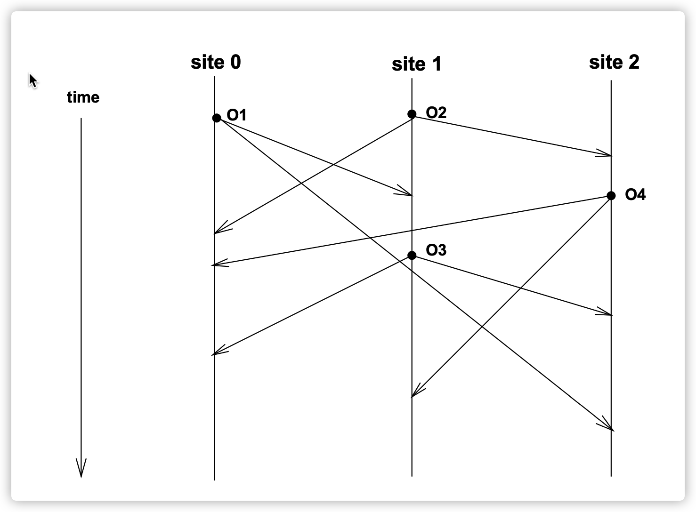

# Operational Transformation in Real-time Group Editors: Issues, Algorithms, and Achievements（1998 ACM Reference）

## Abstract

保持一致性是实时协作系统设计中最重要的挑战。综合性的回顾一下`OT`算法，提出其中的主要问题、算法、成就以及遗留的挑战，同时提供了一个优化算法。

## Keyword

Consistency maintenance: 保持一致性
Operational transformation: 转换操作化
Convergence: 收敛
Causality preservation: 保持因果关系
Intention preservation: 保持意图

## Intro

实时协作的问题是在短响应时间限制下的文档的一致性保持，在分布式环境下支持并发编辑。

`OT` 算法在1989年的 `GROVE` 系统中首创。

本论文会重点关注`OT`算法的一致性保持。还有其他的一致性保持技术，比如轮流编辑、锁、序列化和事务化等等。

论文内容顺序

1. 介绍基础概念和术语
2. GROVE系统的算法介绍
3. GROVE算法中的问题，以及三种解决办法，包括`REDUCE`、`Jupiter`和`adOPTed`
4. 提出一个新的优化算法`GOT`(Generic Operational Transformation)
5. 总结下取得成果以及遗留问题

## Preliminaries

### 定义1: 执行顺序关系 “->”

对于2个操作`Oa`和`Ob`，分别产生于站点`i`和`j`,则 `Oa -> Ob`当且仅当

1. `i =j`时，`Oa`先于`Ob`产生。
2. `i != j`时，`Oa`在`j`站点的执行先于`Ob`操作的产生。(注意是传播后的执行先于本地的操作产生)
3. 存在其他的操作`Ox`，满足`Oa -> Ox`, `Ox -> Ob`

### 定义2: 独立和非独立操作

对于2个操作`Oa`和`Ob`

1. `Ob`依赖`Oa`当切仅当`Oa -> Ob`
2. `Oa`和`Ob`是独立的，表示为`Oa || Ob`，当切仅当`Oa -> Ob`和`Ob -> Oa`均不成立

### Demo

`O1 -> O3`
`O2 -> O3`
`O2 -> O4`

`O1 || O2`
`O1 || O4`
`O3 || O4`
## GROVE实现

为了体验良好的响应速度，避免系统单点故障，`GROVE`实现采用了一个可复制的结构：每一个参与的站点都在本地保存了一份共享文档的复制品。本地操作在产生后会立刻在本地的复制品上执行并且传播给远端站点（在一些延迟和转换后）。

### 发散和因果关系违反的问题

假设远端操作在他们到达站点后立刻以原始内容执行，将会导致2个不一致问题。

各个端的执行`OT`的次序不同，会导致最终结果不同，这就叫`发散(divergence)`。显然发散应该被禁止，最终结果应该是一致的。

由于每个端执行`OT`的次序不同，操作次序可能颠倒因果关系。比如`site0`传播`Oa`给`site1`后，`site1`执行`Oa`后用户基于`Oa`的内容，生成并且执行`Ob`，此时`Oa -> Ob`。对于`site2`，可能会先收到`Ob`，再收到`Oa`，如果`Ob`操作的内容是基于`Oa`的内容，则会导致`site2`中`Ob`内容无法定义。对于`site2`的用户而言，先观察到后发的`Ob`的结果之后，才观察到原因`Oa`。这个问题叫`因果关系违反(causality-violation)`。显然这也应该被禁止。

### 一致性的正确性的规则

基于这两个问题的识别，`GROVE`定义了下面2个原则

1. 收敛原则：所有文档的复制品在静止状态（所有`OT`在所有站点都执行完毕）下应当一致
2. 优先原则：如果一个操作`Oa`在因果关系上先于`Ob`，则在任何站点上，`Oa`应当早于`Ob`执行。

`GROVA`在寻找要求`执行顺序=因果顺序`的解决方法的研究中，发明了后来著名的`distributed OPerational Transformation(dOPT)`算法。`GROVE`的解决方案由2个组件组成：

1. 时间戳状态向量, 用于执行的优先级顺序
2. `dOPT`算法用于确保一致性

`dOPT`算法的基本思路是，如果一个操作满足执行的优先级条件时，首先会根据`Log(所有已执行的操作都会被按次序记录下来)`中的独立操作，被转换为执行独立操作的次序不会生成相同结果的操作，来确保一致性。

### 转换函数

为了确保一致性，`dOPT`算法要求转换函数`T`满足：

对于任意2个独立的操作`Oa`和`Ob`，假设`Oa' = T(Oa, Ob)`，`Ob' = T(Ob, Oa)`，则有

`Oa * Ob'` === `Ob * Oa'`

PS: `T(Oa,Ob)`表示在`Ob`执行的基础上转换`Oa'`，类似于`slatejs`中的`ref`操作

除了上述条件外，GROVE同时识别出转换函数`T`应当实现一些`不可序列化`的效果(意思是有一些边界情况)。比如`Oa`，`Ob`同时删除同一个字符，则转换函数`T`应当确保只有一个字符被删除，无论两个操作的执行次序先后。

### `dOPT`算法简叙

转换函数`T`和具体的操作语义相关，所以是随应用而不同的。但是`dOPT`算法是通用的，而且负责了选区操作(Selecting Operation)并决定了转换次序。基础控制流程比较简单: 对于一个已经处理好因果关系的操作`O`

1. 扫描`LOG`, 找出所有和`O`独立的所有`OP`: `OPS`
2. `EO = OPS.reduce(T(O, OP))`
3. 执行`EO`，并且保存到`LOG`中

### 一个`dOPT`未解决的问题

`GROVE`存在站点优先级，按数字递增，则上图获得结果

site2: z -> xz -> (site3优先，O3优先, O3的因果01被传递优先) ->xzy
site1: x -> xz -> (site3优先，O3优先, O3的因果01被传递优先) -> zxy
site3: y -> (site3优先) -> zy -> (O2优先于O1) -> zxy

这个问题的根源被认为在于简单直白的站点优先级。有论文提出一个复杂的优先级结构来尝试解决这个问题，但是无法自证。

用`OP`保持一致性的创新方法以及这个未解决的问题，很大程度上启发和刺激了大把的研究人员。诸多研究团队，都独立的发现了，

**当一个`OP`和2个或者更多独立的`OP`并发时候，`dOPT`算法无法保证一致性。**

各种实现都提出了一些修正方法，接下来介绍其中三种: `REDUCE`(使用一个一维数据结构来追踪已执行的操作)、`Jupiter`(使用一个二维数据结构来追踪已执行的操作)和`adOPTed`(使用一个N维数据结构来追踪已执行的操作, N为终端数)

## `REDUCE`实现

`REDUCE`跟随`GROVE`采用了一个完全分布式和复制品的系统架构。一个线性的`HistoryBuffer`用于保存所有的已执行的操作(相当于`GROVE`中的`LOG`)。此外还设计了一个垃圾回收机制来移除无用的操作记录。

### 违反编辑意图(intention-violation)问题

除了发散和因果关系违反的问题, `REDUCE`算法还识别到了一类特殊的不一致问题: 违反编辑意图。

回顾下前面的例子：

考虑两个独立操作`O1 || O2`，用户产生`O2`的时候，本地并没有`O1`，但是在站点0上，`O2`执行于`O1`之后，这可能会导致错误的文档位置，导致最终的编辑结果和`O2`的意图不同。

比如文档的初始内容为`ABCDE`

- `O1 = Insert("12", 2)`，`site0`得到`ABCDE -> A12BCDE -> A1CDE`
- `O2 = Delete(3, 2)`, `site1`得到`ABCDE -> ABE -> A12BE`

PS: 注意这里是为了演示问题所在，没有做`转换函数T`

正确的`保留编辑意图`的结果应该为`A12BE`

